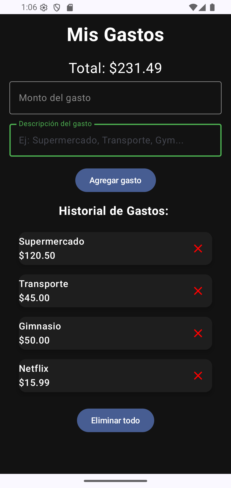

# 💰 Mis Gastos App

Aplicación Android para trackear gastos diarios, desarrollada con Jetpack Compose.

## 📱 Funcionalidades

- ✅ Agregar gastos con descripción y monto
- ✅ Validación de entrada (monto positivo y descripción obligatoria)
- ✅ Visualizar total acumulado en tiempo real
- ✅ Lista completa de todos los gastos con diseño moderno
- ✅ Eliminar gastos individuales
- ✅ Limpiar historial completo
- ✅ **Persistencia de datos** - Los gastos se guardan permanentemente
- ✅ Tema oscuro con Material Design
- ✅ Interfaz moderna con Cards y elevación

## 🛠️ Tecnologías

- **Kotlin**
- **Jetpack Compose**
- **Material Design 3**

## 🚀 En desarrollo

- [ ] Categorías de gastos (comida, transporte, etc.)
- [ ] Filtros por fecha
- [ ] Gráficos de gastos por categoría

## 📸 Screenshots

## 🎯 Objetivo

Proyecto de aprendizaje desarrollado como parte de mi transición profesional hacia el desarrollo Android.